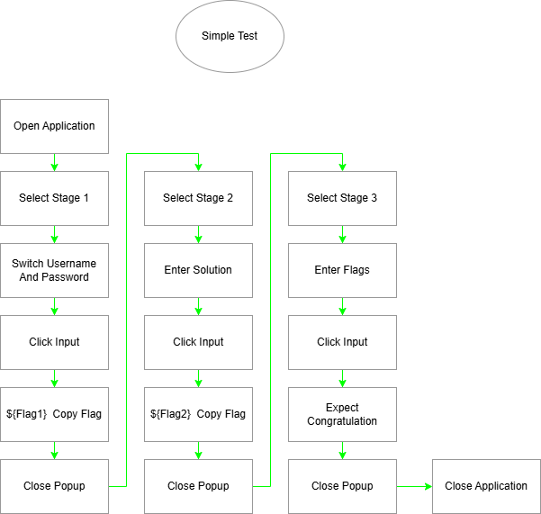
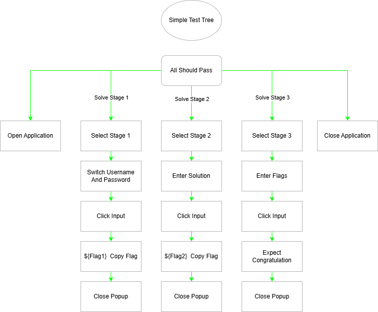
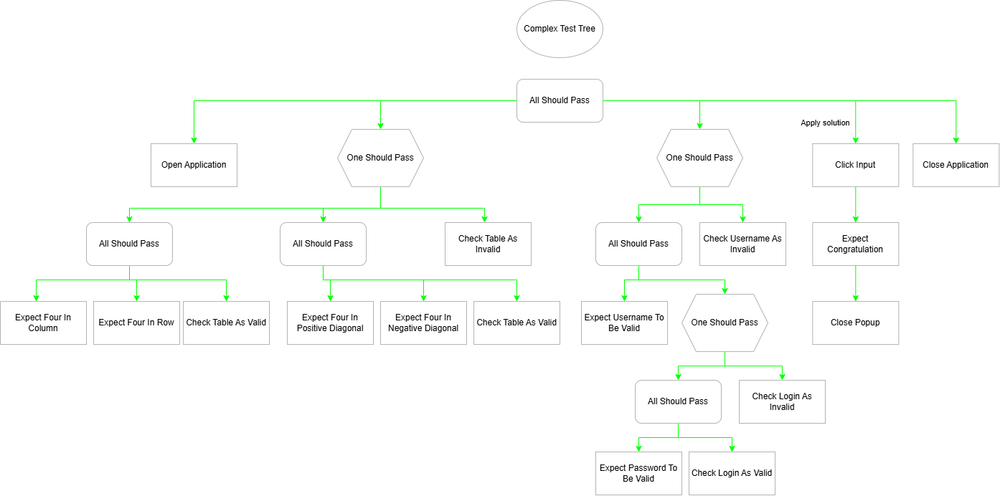

# Demo Tests 🧪
This folder contains test cases for the WPF Puzzle application, a dummy app used to demonstrate testing strategies. The tests are divided into two categories:

- Simple Test Case

- Complex Test Case

## Test case descriptions

Can be found [here](https://github.com/noubar/WPF_Test_Puzzle/blob/main/README.md)

## Test Case BT Representation

**Simple Test**:

  
  OR
  

**Complex Test**:

