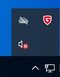
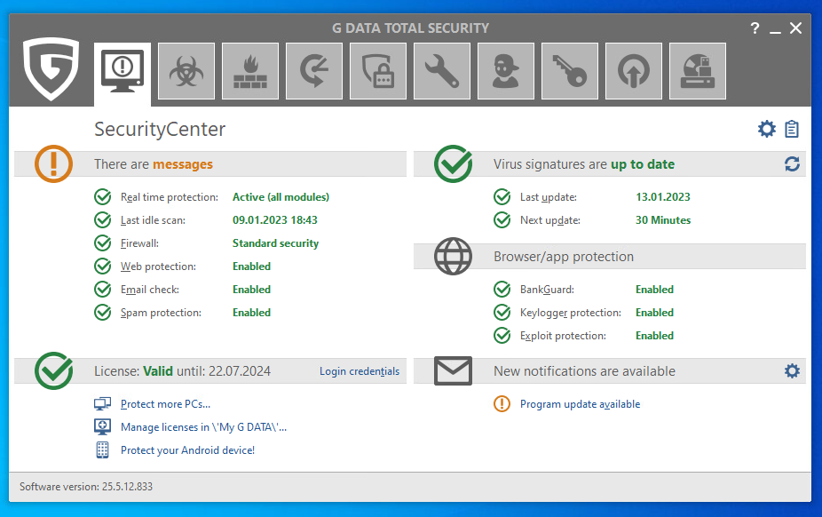

# Real-World-Test

This folder includes a single simple test case used in G Data Cyberdefense AG.
It will be demonstrated how even a simplest GUI application can be complex.

## Test case descriptions

**Testing Steps**:

1. Open Application From Tray\

or

or

2. The Application Should Appear\

3. Close Application